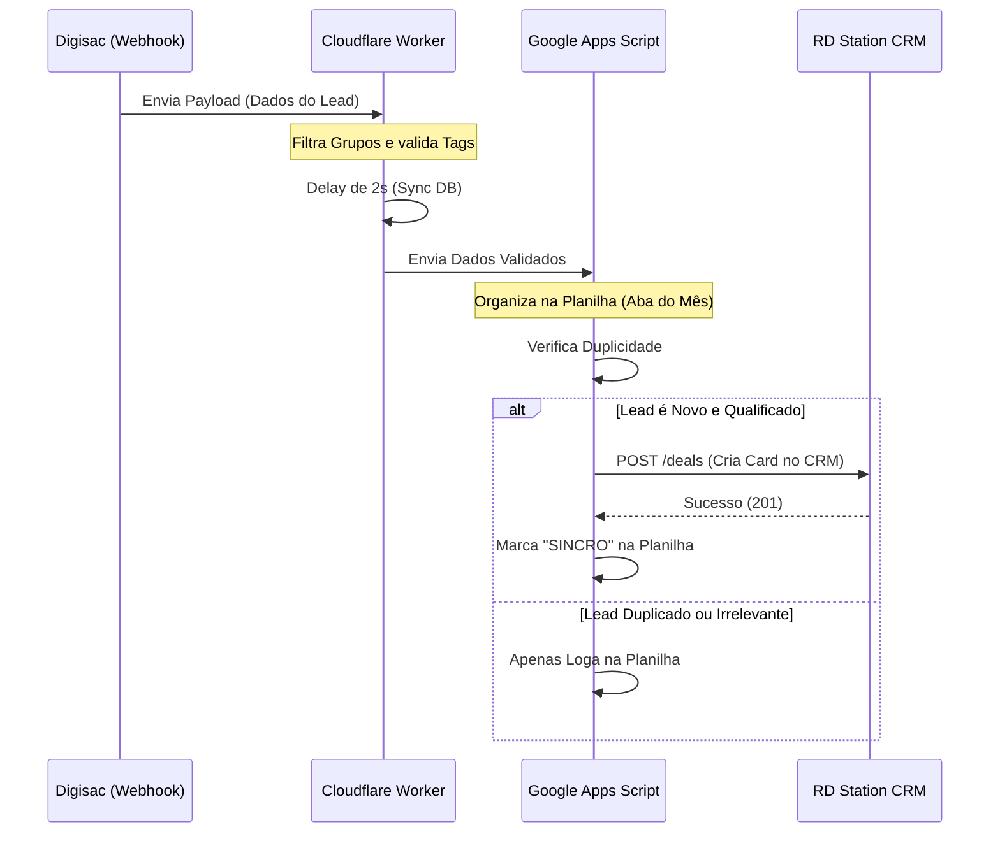

# Automação de Fluxo de Leads: Digisac + Cloudflare + RD Station CRM

Este projeto é uma "ponte" inteligente que filtra, trata e sincroniza dados em tempo real entre a plataforma de atendimento **Digisac** e o **RD Station CRM**.

## Arquitetura da Solução

O fluxo foi desenhado para ser leve, seguro e escalável, utilizando três camadas:

1. **Cloudflare Workers:** Atua como a primeira barreira, ele recebe o Webhook do Digisac, ignora mensagens de grupos e valida se o lead possui todas as informações necessárias (Tags, Origem e Anúncio) antes de prosseguir. Isso economiza processamento e evita "sujeira" no banco de dados.
2. **Google Apps Script:** Recebe os dados validados, organiza-os em planilhas automatizadas (separadas por meses) e verifica duplicidade.
3. **Integração RD Station CRM:** Se o lead for novo e qualificado, o script faz o envio automático para a etapa correta do funil de vendas via API REST.

### Fluxo de Dados

---
    
## Problemas que resolvi com este código:

* **Fim do Trabalho Manual:** Chega de copiar dados do chat para a planilha e depois criar card no CRM.
* **Inteligência de Dados:** Tratamento automático de números de telefone e priorização de nomes (Nome Interno vs. Nome WhatsApp).
* **Filtro de Ruído:** O sistema ignora automaticamente interações em grupos, focando apenas em potenciais clientes.
* **Controle de Duplicidade:** O script verifica se o contato já foi inserido na planilha e se possui uma negociação ativa no CRM antes de criar uma nova, mantendo o funil organizado.

## Tecnologias Utilizadas
* **JavaScript**
* **Cloudflare Workers** - Serverless
* **Google Apps Script** - Automação de Workspace
* **APIs REST** - Digisac e RD Station
* **JSON** - Tratamento de Payloads

---

## Segurança
As chaves de API e IDs de planilhas foram removidos deste repositório por segurança, o código utiliza variáveis de configuração para facilitar a implementação em diferentes ambientes.

*Projeto focado em produtividade e inteligência comercial.*
